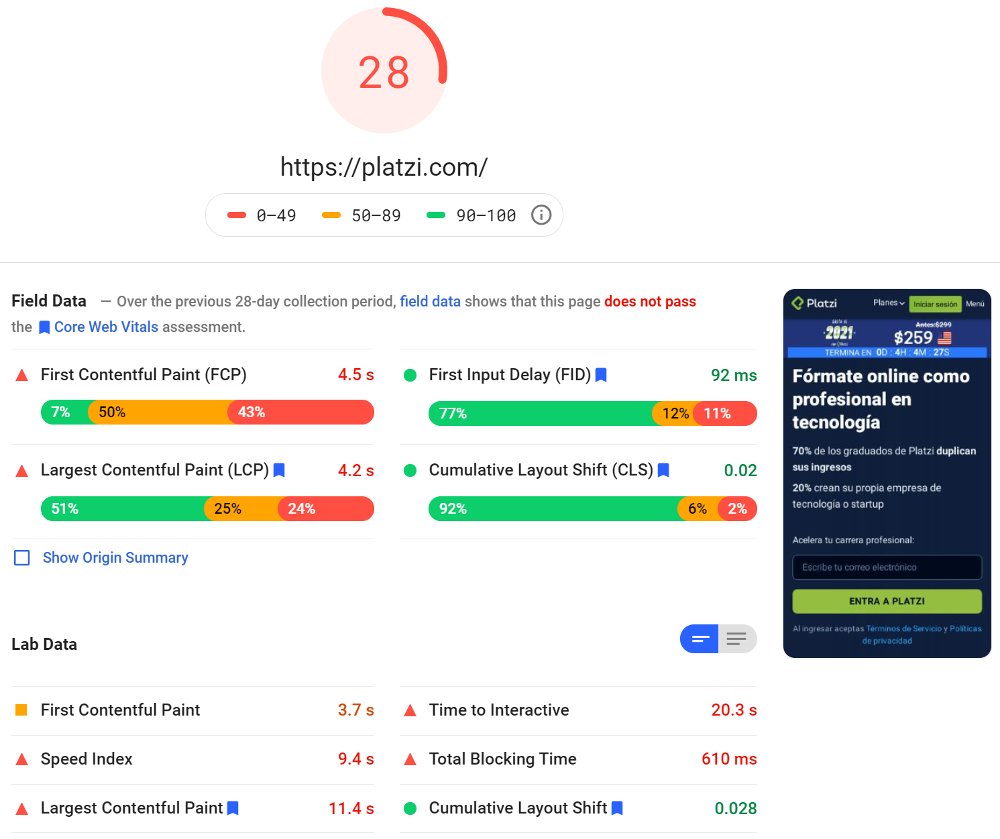

This landing page is based on [Platzi](https://platzi.com)'s landing page. This version does not include any JavaScript (Dropdowns and moving images), but the intention was to see how much I could improve the Web Core Vitals.

This version also includes a light mode which activates based on the system preferences on the device. This was easy to do thanks to TailwindCSS.

You can run a Lighthouse test in your Chrome Web Tools or [here](https://developers.google.com/speed/pagespeed/insights/).

## Before

## After

There some ui issues and there are many details missing, however most of the design was laid out.

It is unlikely that I make any more commits on for this project. I will instead find another website to fix.

Note to self: Safari is the only browser that does not properly render `gap` for flexbox and grid.
